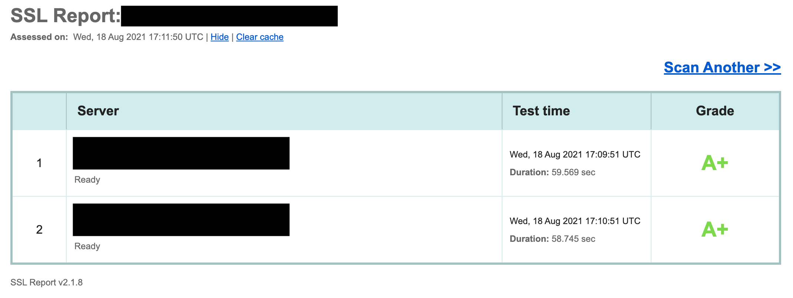

# docker-traefik
Secure implementation of [Traefik](https://github.com/traefik/traefik)


:heart: tested with [Qualys SSL Labs](https://www.ssllabs.com/ssltest/)

## Overview
This docker implementation of Traefik was inspired by Dale Picou's [Traefik image](https://hub.docker.com/r/djpic/traefik). 
There are two key differences between his image and mine:
* Utilizes the latest version of Traefik.
* Implements a secure HTTP middleware that allows all HTTP methods

## How to use :pencil:

### Docker Compose :memo:
When defining your Traefik service, specify the image and add the provider:
```yaml
traefik:
    image: brettfitz/traefik:latest
    ...
    command:
      - --providers.file.filename=/configs/traefik_dynamic_config.yml
```

### Middlewares :twisted_rightwards_arrows:

#### HTTPs redirect only :arrow_right_hook:
Add this deploy label to your container where `myrouter` is the name of your router.
```yaml
- "traefik.http.routers.myrouter.middlewares=https-redirect@file"
```

#### HTTPs redirect + secure-headers :lock:
Add this deploy label to your container where `myrouter` is the name of your router.
```yaml
- "traefik.http.routers.myrouter.middlewares=https-redirect@file, secure-headers@file"
```

## Help / Troubleshooting :construction_worker:
Contact me on Twitter [@_brettfitz](https://twitter.com/_brettfitz) or submit a GitHub issue!
